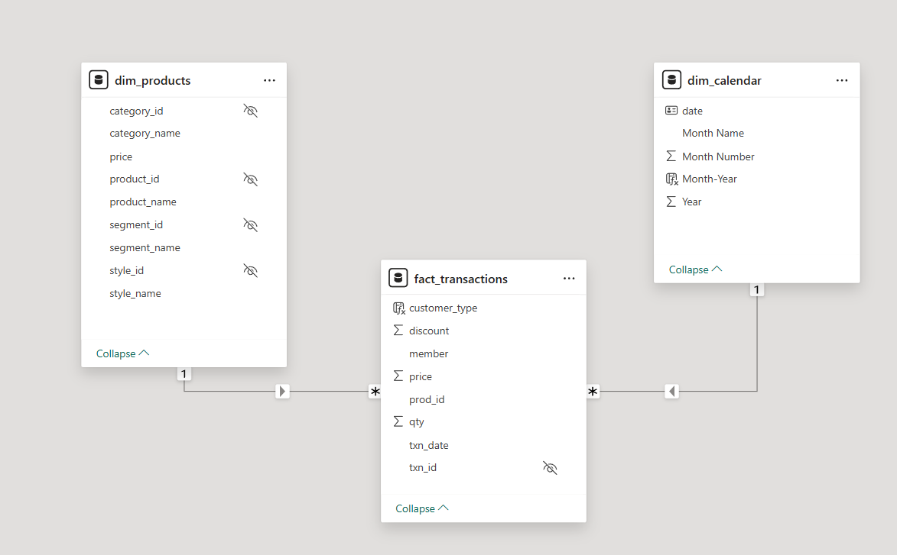

<div align="center">

# 🏪 Balanced Tree Clothing Co. - Retail Sales Analytics


**End-to-end retail analytics using SQL, Power BI, and PostgreSQL**

[View Dashboard](#) | [SQL Queries](./sql_queries) | [Presentation](./presentation)

</div>

---

## 📋 Project Overview

Comprehensive analysis of 3 months of retail sales data (Jan-Mar 2021) for Balanced Tree Clothing Company. Built automated reporting system with SQL stored procedures and interactive Power BI dashboards to drive merchandising decisions.

**Key Deliverables:**
- 30+ SQL queries with advanced techniques (CTEs, window functions, stored procedures)
- 4-page interactive Power BI dashboard with 20+ visualizations
- Automated monthly reporting system
- Strategic business recommendations based on data insights

---

## 💼 Problem Statement
Balanced Tree Clothing Company prides themselves on providing an optimised range of clothing and lifestyle wear for the modern adventurer!
Danny, the CEO of this trendy fashion company has asked you to assist the team’s merchandising teams analyse their sales performance and generate a basic financial report to share with the wider business.Generate automated monthly reports for stakeholders.

For More Details : - https://8weeksqlchallenge.com/case-study-7/

## 🛠️ Tools & Technology

**Database & Analysis:**
- PostgreSQL 13 - Database management
- SQL - Complex queries, CTEs, window functions, stored procedures

**Visualization:**
- Power BI Desktop - Interactive dashboards
- DAX - Advanced calculations and measures

**Development:**
- Git & GitHub - Version control
- VS Code - Query development

**Key Techniques:**
- Star schema data modeling
- Automated reporting with stored procedures
- Time intelligence and comparative analysis
- Customer segmentation analysis

---

## 📁 Project Structure
```
Balanced-Tree-SQL-Analysis/
│
├── README.md
├── datasets/
│   ├── balanced_tree_db_schema.sql
│   └── datasets_overview.md
│
├── sql_queries/
│   ├── balanced_tree_data_exploration.sql
│   ├── High_Level_Sales_Analysis_Queries.sql
│   ├── Transaction_Analysis_Queries.sql
│   ├── Product_Sales_Analysis_Queries.sql
│   └── balanced_tree_monthly_report_query.sql
│
├── monthly_reports/
│   ├── January_2021_Reports/
│   ├── February_2021_Reports/
│   └── March_2021_Reports/
│
├── overall_reports/
│   ├── high_level_sales_analysis_reports/
│   ├── transaction_analysis_reports/
│   └── product_analysis_reports/
│
├── powerbi_visual_reports/
│   ├── balanced_tree_powerbi_report.pbix
│   └── screenshots/
│
└── presentation/
    └── balanced_tree_clothing_ppt.pptx
```

---

## 🔍 Business Questions Analyzed

### **High-Level Sales Analysis**
1. What was the total quantity sold for all products?
2. What is the total generated revenue for all products before discounts?
3. What was the total discount amount for all products?

### **Transaction Analysis**
4. How many unique transactions were there?
5. What is the average unique products purchased in each transaction?
6. What are the 25th, 50th and 75th percentile values for revenue per transaction?
7. What is the average discount value per transaction?
8. What is the percentage split of transactions for members vs non-members?
9. What is the average revenue for member vs non-member transactions?

### **Product Analysis**
10. What are the top 3 products by total revenue before discount?
11. What is the total quantity, revenue and discount for each segment?
12. What is the top selling product for each segment?
13. What is the total quantity, revenue and discount for each category?
14. What is the top selling product for each category?
15. What is the percentage split of revenue by product for each segment?
16. What is the percentage split of revenue by segment for each category?
17. What is the percentage split of total revenue by category?
18. What is the total transaction penetration for each product?
19. What is the most common combination of at least 1 quantity of any 3 products?

---

## 💡 Key Insights

### **Revenue Performance**
- **Total Net Revenue(3 months):** $1.13M (after discounts| Net Revenue)
- **Gross Revenue(3 months):** $1.29M (before discounts)
- **Category Split(3 months):** Mens 55% | Womens 45%
- **Top Product(3 months):** Blue Polo Shirt - Mens ($218K gross revenue| revenue before discount)

### **Customer Behavior**
- **Member Transactions:** 60% (1,505 transactions)
- **Non-Member Transactions:** 40% (995 transactions)
- **Member Avg Spend(3 months):** $454.14
- **Non-Member Avg Spend(3 months):** $452.01
- **Key Finding:** Only 0.47% spending difference - opportunity to enhance membership value

### **Discount Analysis**
- **Avg Discount/Transaction(3 months):** $62.50
- **Total Discounts (3 months):** $156.23K
- **Discount % of Gross Revenue(3 months):** 12.12%
- **Opportunity:** Significant optimization potential

### **Product Performance**
- **Balanced Penetration:** All products show an uniform transaction penetration rate with a narrow range between 49.68% to 51.24%
- **Avg Products/Transaction:** 6 items
- **Cross-Sell Opportunity:** High basket diversity ideal for bundling strategies

---

## 📊 Data Visualization Using Power BI

### **Dashboard Architecture**

**4-Page Interactive Dashboard:**

#### **1. Home Page - Navigation Hub**
- Project overview and KPI legend
- Navigation buttons to all dashboard sections
- Current reporting period display

#### **2. Executive View - Strategic Metrics**
**KPIs:** Gross Revenue | Total Transactions Count | Total Discounts | Net Revenue | Average Transactional Spend

**Visualizations:**
- Line chart: Daily revenue trends
- Pie chart: Category revenue split (Mens/Womens)
- Bar chart: Top 5 Products Based on Quantity Sold
- KPI cards with trend indicators

**Business Value:** Quick assessment of overall performance and revenue health


#### **3. Sales View - Product Analysis**
**KPIs:** Total Quantity Sold | Average Daily Revenue | Transaction Count | Net Revenue

**Visualizations:**
- Stacked Column chart: Revenue Split By Segment(Jacket , Jeans , Socks , Shirt)
- Stacked bar: Revenue by category and segment
- Table: Detailed product metrics
- Line chart: Daily sales trends & Average Daily Revenue for Comparison

**Filters:** Month 

**Insights:** Product performance, best sellers, category comparisons, sales patterns


#### **4. Marketing View - Customer Insights**
**KPIs:** Average Member Spend | Average Non-Member Spend | Total Discount | Member Revenue (%)

**Visualizations:**
- Pie chart: Transaction distribution by customer type
- bar chart : Revenue Distribution by customer type
- Line chart: Discount trends
- Matrix: Category performance by customer type
- Pe Chart : Discount Distribution by customer type or member type

**Strategic Value:** Customer segmentation, loyalty program effectiveness, conversion opportunities


- View Full Live Power Bi Dashboard Here: - (https://app.powerbi.com/view?r=eyJrIjoiYWY0ZGViMWUtMTNmMi00NzcyLWJhZTAtZjk0MGZlZTlhNTljIiwidCI6ImJmOGY3NjI3LTQ2MmQtNGFhMC1iMWVlLWNhMzc5ZDlhZTA3OCJ9)

### **Data Model**

**Star Schema Design:**
- **Fact Table:** fact_transactions (15,000+ transactions)
- **Dimension Tables:** dim_products(12 differenct products) | dim_calendar
- **Relationships:** One-to-many from dimensions to fact
- **Optimization:** Fast aggregations and seamless filtering



### **Key DAX Measures**
```dax
GR (Gross Revenue) =  SUMX(fact_transactions , fact_transactions[price] * fact_transactions[qty] )

TOT DISC (Total Discount) = SUMX(fact_transactions , (fact_transactions[discount] * fact_transactions[qty] * fact_transactions[price] ) / 100 )

NR (Net Revenue) = [Gr] - [TOT DISC]

Total QTY Sold = sum(fact_transactions[qty])

TXN Count = DISTINCTCOUNT(fact_transactions[txn_id])

Average Daily Revenue(ADR) =
    VAR AllRevenue = CALCULATE([NR], ALLSELECTED(dim_calendar))
    VAR AllDays = CALCULATE(DISTINCTCOUNT(fact_transactions[txn_date]), ALLSELECTED(dim_calendar))
    RETURN
        DIVIDE(AllRevenue, AllDays, 0)

ATS (Average Transaction Spend) = DIVIDE([NR] , [TXN Count] , 0) 

Total Members Revenue($) = CALCULATE([NR] , fact_transactions[member] = TRUE())

Total Members Transactions = CALCULATE([TXN Count] , fact_transactions[member] = TRUE())

Total Non-Member Transaction = CALCULATE([TXN Count],fact_transactions[member] = FALSE())

Total Non-Members Revenue($) = CALCULATE([NR] , fact_transactions[member] = FALSE())

AMS($) = DIVIDE([Total Members Revenue($)] , [Total Members Transactions] , 0)

ANMS($) = DIVIDE([Total Non-Members Revenue($)] ,[Total Non-Member Transaction])

Average Daily Discount = 
var TotalDiscount = CALCULATE([TOT DISC] , ALLSELECTED(dim_calendar))
var TotalDays = CALCULATE(DISTINCTCOUNT(fact_transactions[txn_date]) , ALLSELECTED(dim_calendar))
return
    DIVIDE(TotalDiscount , TotalDays , 0)

```

## 🎯 Strategic Recommendations

### **1. Optimize Discount Strategy**
**Current:** $62.50 avg discount/transaction, $156K total (12.12% of gross revenue)  
**Action:** Implement tiered discounting based on cart value  
**Impact:** 10-15% reduction in discount costs (~$15K - $22K savings)

### **2. Enhance Membership Program**
**Current:** Members spend only 0.47% more ($454.14 vs $452.01)  
**Action:** Strengthen member-exclusive benefits and personalized offers  
**Impact:** Increase member AOV by 5-8%

### **3. Implement Product Bundling**
**Current:** Balanced 49-51% penetration, avg 6 products/transaction  
**Action:** Create strategic bundles and "Complete Look" packages  
**Impact:** 8-12% increase in basket size

### **4. Boost Non-Member Conversion**
**Current:** 40% transactions from non-members with similar spending  
**Action:** First-purchase incentives and easy join-at-checkout  
**Impact:** Convert 15-20% to members, grow loyalty base

## 🚀 How to Use This Project

### **Prerequisites**
- PostgreSQL 13+
- Power BI Desktop
- Git

### **Setup Steps**

**1. Clone Repository**
```bash
git clone https://github.com/Coderbiswajit24/Balanced-Tree-SQL-Analysis.git
cd Balanced-Tree-SQL-Analysis
```

**2. Database Setup**
```sql
-- Create database and schema
CREATE DATABASE balanced_tree;
CREATE SCHEMA balanced_tree;

-- Run schema script
\i datasets/balanced_tree_db_schema.sql
```

**3. Run SQL Queries**
```bash
# Execute analysis queries
psql -d balanced_tree -f sql_queries/High_Level_Sales_Analysis_Queries.sql
psql -d balanced_tree -f sql_queries/Transaction_Analysis_Queries.sql
psql -d balanced_tree -f sql_queries/Product_Sales_Analysis_Queries.sql
```

**4. Generate Monthly Reports**
```sql
CALL balanced_tree.generate_monthly_report(2021, 1);  -- January
```

**5. Open Power BI Dashboard**
- Open `powerbi_visual_reports/balanced_tree_powerbi_report.pbix`
- Refresh data connection if needed

---

## 📚 Key Learnings

**SQL Mastery:**
- Complex CTEs and recursive queries for hierarchy analysis
- Window functions (PERCENTILE_CONT, ROW_NUMBER, RANK)
- Stored procedures for automated reporting
- Query optimization and performance tuning

**Power BI Expertise:**
- Star schema data modeling
- Advanced DAX measures and time intelligence
- Interactive dashboard design principles
- User experience optimization

**Business Analytics:**
- Translating data into actionable insights
- Customer segmentation and behavior analysis
- Revenue optimization strategies
- Data-driven strategic recommendations

**Domain Knowledge:**
- Retail analytics and merchandising
- Customer loyalty program analysis
- Discount strategy evaluation
- Product performance metrics

---

## 📬 Connect With Me

<div align="center">

[](https://www.linkedin.com/in/biswajitsasmal)
[](mailto:biswajitsasmal.data@gmail.com)

**💼 Open to Data Analyst Opportunities | 📍 India | 🌐 Remote-Friendly**

</div>

---

<div align="center">

### ⭐ If you found this project helpful, please star the repository!

*Part of the [8 Week SQL Challenge](https://8weeksqlchallenge.com/case-study-7/) by Danny Ma*

</div>